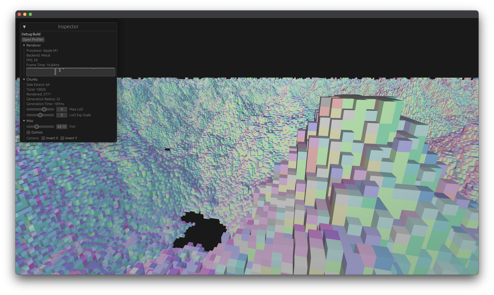

# Endless

Voxel generation



Controls:

- `W`, `A`, `S`, `D` to move
- `⌥` + `W`, `⌥` + `S` to move up and down
- Combine with `⇧` to move faster
- `⌘` + `Q` to quit


## WIP: Declarative terrain generation

- Abstracts lodding away
- Compiled to a computer shader
- `x.f(y)` == `f(x, y)`
- Real-time feedback
- Static analysis like NaN avoidance
- No arguments, e.g. no generalized operations like blurring

```
height: field<float, 2>
|> {
    // @x, @y, @z are world-space coordinates of the voxel
    n = fbm(@x, @y);
    n = n.abs().powf(1.5).copysign(n)
    n *= 50
    n
}

blurred_normal: field<float, 2>
|> normal
|> {
    // $ is the input value, e.g. the normal in this case
    $x
}
|> blur
```
